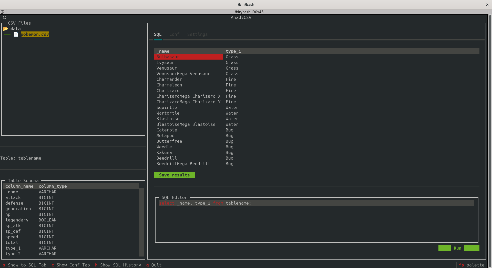

# AnadiCSV

This tool aims to allow the user to interrogate a csv file using SQL language.

## Supported Container Engine

   - Docker
   - Podman

## Supported O.S.

   - Linux
   - OSX





## How to install

Run the script *install.sh* with superuser privileges.

```shell
$ cd AnadiCSV

$ sudo ./install.sh

```

## How to use

### Help

```shell
$ anadi -h
usage: AnadiCSV [-h] -d DIR

Handle csv file using SQL language

options:
  -h, --help         show this help message and exit
  -d DIR, --dir DIR  CSV file dir
```

### How to run

By default anadi use te current folder to find CSV files

```shell
anadi
```

if your files are in a different location use *-d* options


```shell
anadi -d DATA_DIR
```

## UI

### Conf Tab

In this tab you can set how to interprete the CSV file.

#### Tablename

It is the name used in 'FROM' keyword inside the query to refer to the table.

Default: *tablename*.

#### CSV Delimitator

Is the character used to separate the data inside the CSV.

Default: *,*.

#### Skip

The Skip option allows you to skip a number of rows at the beginning of your data series. This is useful for omitting metadata or comments that may precede the actual data.
Specify the lines that you want to skip. For example, if you set Skip to 2, the first two rows will be ignored when processing the data set.

Default: *0*.

##### Example

Imagine you have the following CSV file

```csv
1,2,3,4
01-01-2024,16,0,1000
02-01-2024,15,0,1010
03-01-2024,16,0.1,1020
```
Setting _Skip_ as 1 Anadi to ignore the first line.


#### Header

Specify if the CSV file has a header (the row in which you can see each column name).
When you enable this option. The first row of your data is considered the header. The next row will contain the actual data.

Default: *enabled*.

##### Example

Suppose to have the following CSV file

```csv
Date,Temperature,Wind Speed,Air Pressure
01-01-2024,16,0,1000
02-01-2024,15,0,1010
03-01-2024,16,0.1,1020
```

Enabling the _Header_ option Anadi knows that the first line is the header and so construct the columns name using those
information.
So the columns name are:
 - Date
 - Temperature
 - Wind Speed
 - Ait Pressure.

Instead if you have the following one


```csv
1,2,3,4
Date,Temperature,Wind Speed,Air Pressure
01-01-2024,16,0,1000
02-01-2024,15,0,1010
03-01-2024,16,0.1,1020
```

You need to use both _Skip_ equal to 1 and enabling _Header_ option.

#### Normalize name

The Normalize Names option normalizes the column naming format. This helps ensure consistency and prevents problems caused by naming variations (e.g. spaces, case sensitivity).
When activated This option converts all column names to a specific format (such as lowercase letters, underscores instead of spaces) to facilitate data management and analysis.

Default: *enabled*

##### Example

Suppose to have the following CSV file

```csv
1,2,3,4
Date,Temperature,Wind Speed,Air Pressure
01-01-2024,16,0,1000
02-01-2024,15,0,1010
03-01-2024,16,0.1,1020
```

If you use the last conf and enable the _normalize name_ option the column name will be in lower case and the spaces are replaced with underscores, they will be:

 - date
 - temperature
 - wind_speed
 - air_pressure.
 

## How Contribute

Please read [CONTRIBUTING.md](CONTRIBUTING.md) file.
